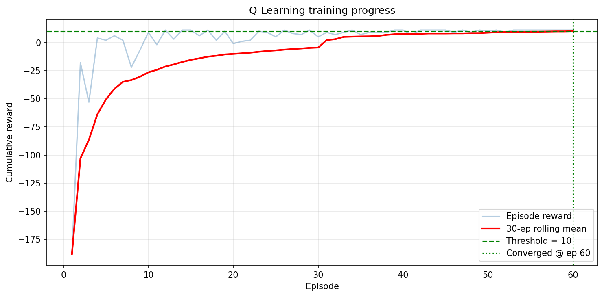
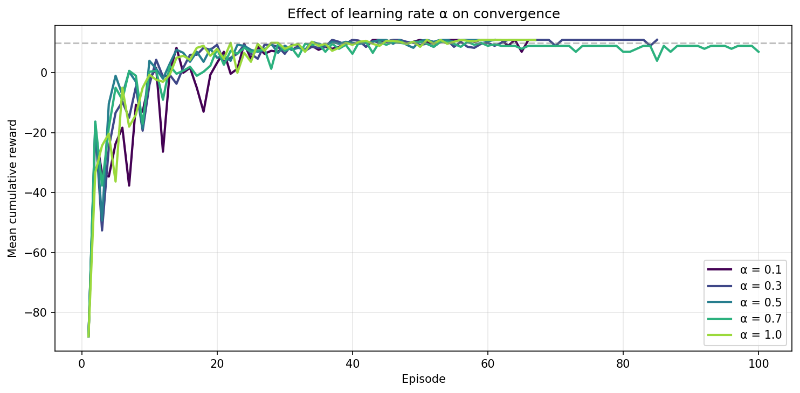
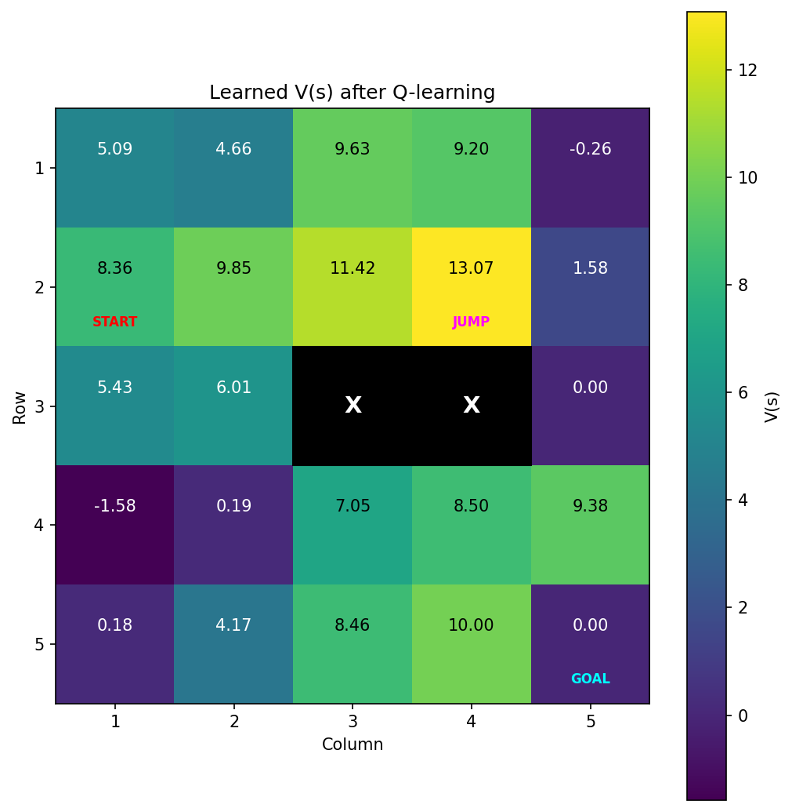
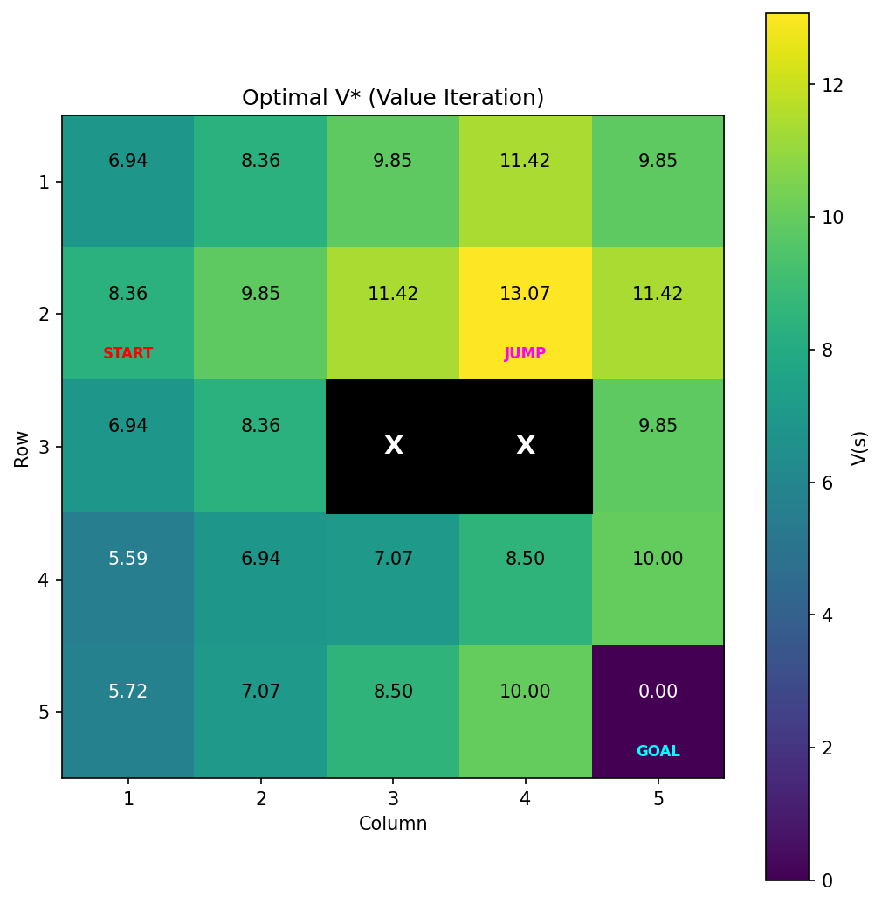
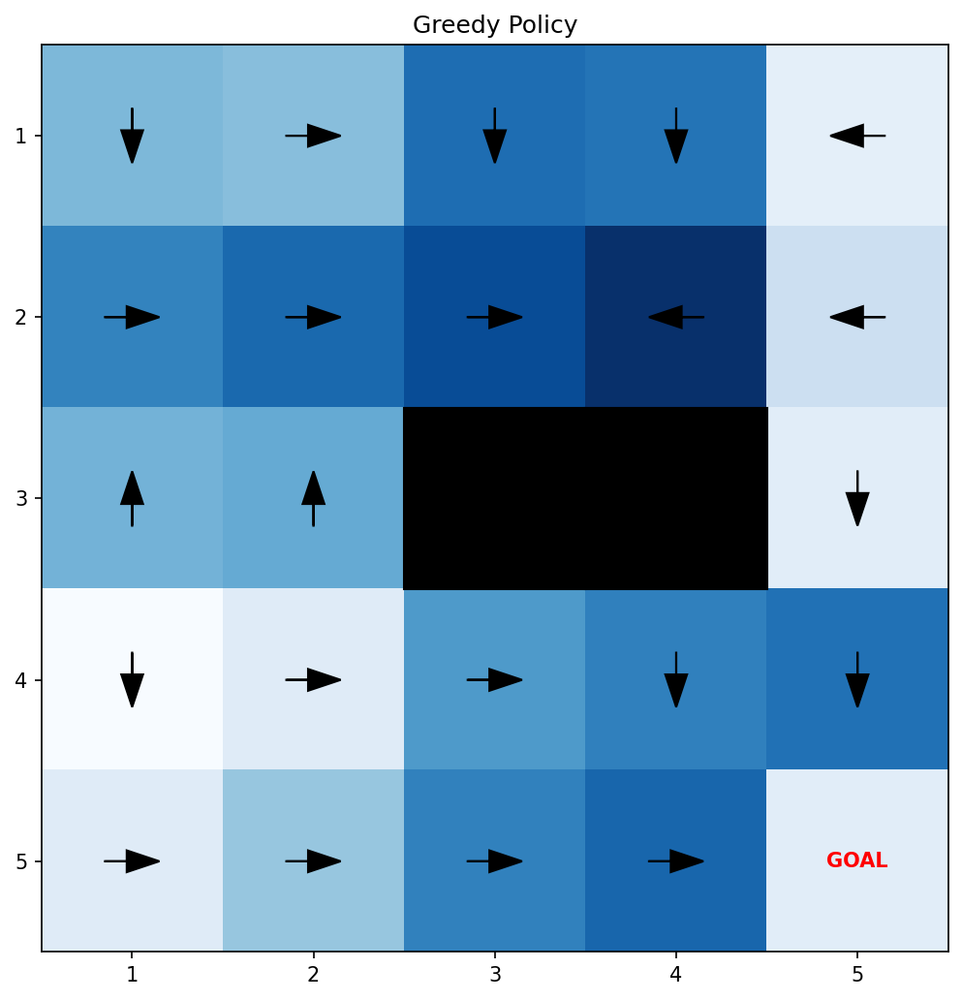
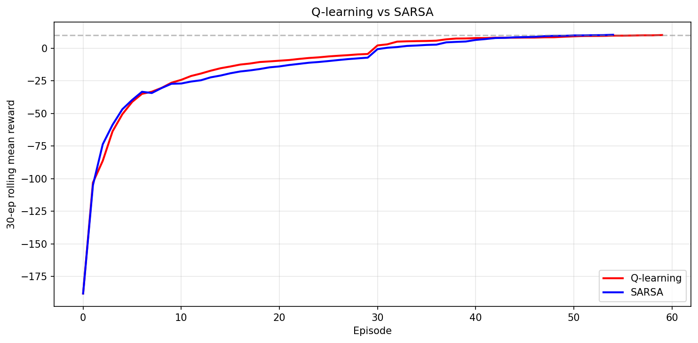

# Q-Learning Grid World

> A tabular Q-learning agent that learns to navigate a 5×5 grid with obstacles and a teleport shortcut, benchmarked against the analytical Bellman optimum and compared against SARSA.

[](https://www.python.org/downloads/)
[](LICENSE)
[](tests/)
[](https://your-app-url.streamlit.app)

**🚀 Live demo:** [q-learning-gridworld.streamlit.app]([https://q-learning-gridworld.streamlit.app](https://q-learning-gridworld-g2o8bb4dxnvrex9rbaf4kn.streamlit.app/)
---

## Results at a glance

| Metric | Value |
|---|---|
| Episodes to converge | **60** |
| Optimal path length | **6 steps** |
| Total reward (greedy rollout) | **+11** |
| Path | (2,1) → (2,2) → (2,3) → (2,4) → (4,4) → (5,4) → (5,5) |
| Learned V(s) at jump cell | **13.07** (matches Bellman optimum) |

The agent discovers the teleport shortcut at (2,4) → (4,4) without any hand-crafted prior, simply because the +5 jump reward dominates the longer detour once the discount factor is taken into account.



---

## What this project demonstrates

- **Reinforcement learning fundamentals** — tabular Q-learning, SARSA, epsilon-greedy exploration with multiplicative decay, TD error, off-policy vs on-policy bootstrapping
- **Software engineering** — modular package structure, type hints, dataclasses, unit tests with pytest, CLI argument parsing, reproducible RNG seeding
- **Empirical rigour** — hyperparameter sweep across α ∈ {0.1, 0.3, 0.5, 0.7, 1.0} with three seeds each, results averaged
- **Theoretical grounding** — analytical Bellman value iteration computed as ground-truth baseline, cell-by-cell comparison with the learned V(s)
- **Visualisation** — state-value heatmaps, greedy policy arrows, learning curves, algorithm comparisons

This was originally produced for the **COM762 Intelligent Systems** module at Ulster University as part of an MSc in Artificial Intelligence, then refactored to production quality for portfolio use.

---

## Tech stack

| Layer | Tools |
|---|---|
| Language | Python 3.10+ |
| Numerical | NumPy |
| Visualisation | Matplotlib |
| UI | Streamlit |
| Testing | pytest |
| Quality | Type hints, dataclasses |

---

## Project structure

```
q-learning-gridworld/
├── src/
│   ├── __init__.py
│   ├── environment.py       # GridWorld MDP, states, actions, transitions
│   ├── agent.py             # QLearningAgent and SARSAAgent
│   └── main.py              # Training driver, value iteration, CLI, plots
├── tests/
│   └── test_gridworld.py    # 14 unit + integration tests
├── docs/
│   └── plots/               # Reference figures used in README
├── streamlit_app.py         # Interactive web demo
├── requirements.txt
├── .gitignore
├── LICENSE
└── README.md
```

---

## Quick start

### 1. Clone and install

```bash
git clone https://github.com/mohammedsalmankhan/q-learning-gridworld.git
cd q-learning-gridworld
pip install -r requirements.txt
```

### 2. Run training and reproduce the figures

```bash
python src/main.py
```

This trains a Q-learning agent with α=0.5, runs the SARSA comparison, performs the learning rate sweep, and saves all figures to `./plots/`.

### 3. Run the interactive demo

```bash
streamlit run streamlit_app.py
```

A browser tab will open where you can adjust α, γ, ε-decay, episodes, and the random seed, and watch the agent learn live.

### 4. Run the tests

```bash
pytest tests/ -v
```

All 14 tests should pass in under three seconds.

---

## Usage examples

**Default training run:**

```bash
python src/main.py
```

**Sweep with a different learning rate and seed:**

```bash
python src/main.py --alpha 0.3 --seed 7
```

**Quick run without the multi-seed sweep:**

```bash
python src/main.py --skip-sweep
```

**Programmatic use:**

```python
from src.environment import GridWorld
from src.agent import QLearningAgent
from src.main import train_q, evaluate_greedy

env = GridWorld()
agent = QLearningAgent(alpha=0.5, seed=42)
rewards, rolling, _, converged = train_q(env, agent)
path, total = evaluate_greedy(GridWorld(), agent)
print(f"Reached goal in {len(path) - 1} steps with reward {total}")
```

---

## Key results

### Learning rate sweep

| α | Mean episodes to converge | Mean final reward |
|---|---|---|
| 0.1 | 62.0 | 10.33 |
| 0.3 | 69.7 | **11.00** |
| 0.5 | **59.3** | **11.00** |
| 0.7 | 73.0 | 9.33 |
| 1.0 | 61.3 | **11.00** |

α = 0.5 gives the best balance of stability and convergence speed. Higher learning rates converge fast but become noisy once the policy is near-optimal because each large TD update can destabilise well-estimated cells.



### Learned state values vs Bellman optimum

The learned values match the Bellman optimum **exactly** on every cell along the agent's preferred trajectory. Off-trajectory cells retain residual TD error — a known property of model-free Q-learning under finite ε-decay, since rarely-visited states do not receive enough updates to converge.

| Learned V(s) | Optimal V*(s) |
|---|---|
|  |  |

### Greedy policy



### Q-learning vs SARSA

Both algorithms converge to the same optimal trajectory. On this deterministic, hazard-free grid the off-policy and on-policy targets coincide along the trajectory, so the curves track closely. In a stochastic or "cliff-walking" environment the gap would widen considerably.



---

## Future improvements

- Function approximation with a small neural network (DQN) to scale beyond tabular state spaces
- Stochastic transitions and slippery cells to widen the Q-learning vs SARSA gap
- Reward shaping and intrinsic motivation to address the off-trajectory coverage problem
- Larger, procedurally generated grid worlds with curriculum learning
- Deploy the Streamlit demo to a public URL with persistent best-policy storage

---

## License

MIT — see [LICENSE](LICENSE).

---

## About

Built by **Salman Khan**, MSc Artificial Intelligence at Ulster University.

- 📧 mohammedsalmankhans636@gmail.com
- 💼 [LinkedIn](https://www.linkedin.com/) *(update with your URL)*
- 🌐 [GitHub](https://github.com/mohammedsalmankhan)
